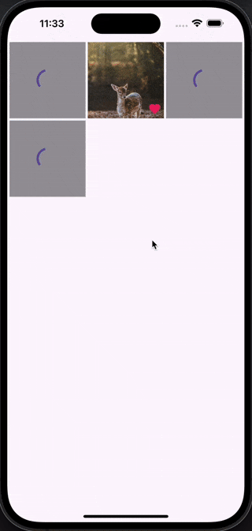

# simple_gallery

An easy way to display images as a gallery in full-screen with Hero animation, including pinch, zoom, drag & double tap to zoom.

It also can show any widgets instead of an image type, such as Container, Text or a SVG,...


## Installation

Add `simple_gallery` as a dependency in your pubspec.yaml file.

Import Simple Gallery:
```dart
import 'package:simple_gallery/simple_gallery.dart';
```

## Features

* Show a list of images(widgets) in GridView (Allow to custom the GridView properties)
* Allow to custom each item in GridView  using `itemBuilder`
* By clicking to GridView item to show each detail widget in full-screen in a PageView
* Allow to custom the detail widget using `detailDecoration`
* Use pinch & zoom to zoom in and out of images(widgets)
* Enable to drag up & down the detail widget with opacity background to back to GridView with Hero animation
* Allow to scroll with page snap to view each detail widget in PageView
* Fully customizable loading/progress indicator
* Allow double tapping to zoom
* No dependencies besides Flutter


## Basic usage

For example, to show several images with paths:

```dark
  @override
  Widget build(BuildContext context) {
    return Scaffold(
      body: SimpleGallery<String>(
        items: imageFiles,
        itemSize: (item) => getImageSize(item),
        placeholderBuilder: (context, item) {
            return ColoredBox(
              color: Colors.black38,
              child: Center(child: CircularProgressIndicator()),
            );
          },
        itemBuilder: (context, item, itemSize, viewSize) {
          return Image.file(
            File(item),
            cacheWidth: viewSize.width.round(),
            fit: BoxFit.cover,
          );
        },
        detailDecoration: DetailDecoration(
          detailBuilder: (context, item, itemSize, viewSize) {
            return Image.file(File(item), fit: BoxFit.contain);
          },
          placeholderBuilder: (context, item) {
            return ColoredBox(
              color: Colors.black38,
              child: Center(child: CircularProgressIndicator()),
            );
          },
          pageGap: 16,
        ),
      ),
    );
  }
```

Note: `itemSize` is the size of image, it is required for Hero animation and cache image.


## Show difference type of image

You can use any types for gallery (SimpleGallery<YourType>) and custom the way that the content in both Gridview and PageView is displayed using `itemBuilder` & `detailBuilder`
This example is using NetworkImage:

```dart
  List<NetworkImage> listNetworkImages = [
  const NetworkImage("https://picsum.photos/id/1001/4912/3264"),
  const NetworkImage("https://picsum.photos/id/1003/1181/1772"),
  const NetworkImage("https://picsum.photos/id/1004/4912/3264"),
  const NetworkImage("https://picsum.photos/id/1005/4912/3264")
];

  @override
  Widget build(BuildContext context) {
    return Scaffold(
      body: SimpleGallery<NetworkImage>(
        items: listNetworkImages,
        itemSize: (item) => getImageSize(item),
        placeholderBuilder: (context, item) {
          return ColoredBox(
            color: Colors.black38,
            child: Center(child: CircularProgressIndicator()),
          );
        },
        itemBuilder: (context, item, itemSize, viewSize) {
          return Image(image: item, fit: BoxFit.cover,);
        },
        detailDecoration: DetailDecoration(
          detailBuilder: (context, item, itemSize, viewSize) {
            return Image(image: item, fit: BoxFit.contain);
          },
          placeholderBuilder: (context, item) {
            return ColoredBox(
              color: Colors.black38,
              child: Center(child: CircularProgressIndicator()),
            );
          },
          pageGap: 16,
        ),
      ),
    );
  }
```


## Custom the Gallery

Support you custom the GridView of list images with some properties:

```dart
  @override
Widget build(BuildContext context) {
  return Scaffold(
    body: SimpleGallery<NetworkImage>(
      items: listNetworkImages,
      itemSize: (item) => getImageSize(item),
      crossAxisCount: 5,
      crossAxisSpacing: 8.0,
      mainAxisSpacing: 8.0,
      childAspectRatio: 1.0,
      padding: const EdgeInsets.all(8.0),
      placeholderBuilder: (context, item) {
        return ColoredBox(
          color: Colors.black38,
          child: Center(child: CircularProgressIndicator()),
        );
      },
      itemBuilder: (context, item, itemSize, viewSize) {
        return Image(image: item, fit: BoxFit.cover,);
      },
      detailDecoration: DetailDecoration(
        detailBuilder: (context, item, itemSize, viewSize) {
          return Image(image: item, fit: BoxFit.contain);
        },
        placeholderBuilder: (context, item) {
          return ColoredBox(
            color: Colors.black38,
            child: Center(child: CircularProgressIndicator()),
          );
        },
        pageGap: 16,
      ),
    ),
  );
}
```


Allow to custom each item in Gallery using `itemBuilder` & `detailBuilder`:

```dart
List<NetworkImage> listNetworkImages = [
    const NetworkImage("https://picsum.photos/id/1001/4912/3264"),
    const NetworkImage("https://picsum.photos/id/1003/1181/1772"),
    const NetworkImage("https://picsum.photos/id/1004/4912/3264"),
    const NetworkImage("https://picsum.photos/id/1005/4912/3264"),
  ];

  @override
  Widget build(BuildContext context) {
    return Scaffold(
      body: SafeArea(
        child: SimpleGallery<NetworkImage>(
          items: listNetworkImages,
          itemSize: (item) => getNetworkImageSize(item.url.toString()),
          placeholderBuilder: (context, item) {
            return ColoredBox(
              color: Colors.black38,
              child: Center(child: CircularProgressIndicator()),
            );
          },
          itemBuilder: (context, item, itemSize, viewSize) {
            return Stack(
              children: [
                Positioned.fill(child: Image(image: item, fit: BoxFit.cover)),
                Positioned(
                  bottom: 5,
                  right: 5,
                  child: Icon(Icons.favorite, color: Colors.pink),
                ),
              ],
            );
          },
          detailDecoration: DetailDecoration(
            detailBuilder: (context, item, itemSize, viewSize) {
              return Stack(
                children: [
                  Positioned.fill(
                    child: Image(image: item, fit: BoxFit.contain),
                  ),
                  Positioned(
                    bottom: 5,
                    right: 5,
                    child: Icon(Icons.favorite, color: Colors.pink),
                  ),
                ],
              );
            },
            placeholderBuilder: (context, item) {
              return ColoredBox(
                color: Colors.black38,
                child: Center(child: CircularProgressIndicator()),
              );
            },
            pageGap: 16,
          ),
        ),
      ),
    );
  }
```




## Custom the placeHolder,header & footer in detail screen

Using `detailDecoration` to custom the background,placeHolder,header & footer for detail widget in PageView

```dart
  @override
Widget build(BuildContext context) {
  return Scaffold(
    body: SimpleGallery<NetworkImage>(
      items: listNetworkImages,
      itemSize: (item) => getImageSize(item),
      placeholderBuilder: (context, item) {
        return ColoredBox(
          color: Colors.black38,
          child: Center(child: CircularProgressIndicator()),
        );
      },
      itemBuilder: (context, item, itemSize, viewSize) {
        return Image(image: item, fit: BoxFit.cover,);
      },
      detailDecoration: DetailDecoration(
        backgroundWidget: ColoredBox(color: Colors.yellow),
        headerBuilder: _buildHeaderDetail,
        footerBuilder: _buildFooterDetail,
        placeholderBuilder: (context, item) {
          return ColoredBox(
            color: Colors.black38,
            child: Center(child: CircularProgressIndicator()),
          );
        },
        detailBuilder: (context, item, itemSize, viewSize) {
          return Image(image: item, fit: BoxFit.contain);
        },
        pageGap: 16,
      ),
    ),
  );
}

Widget _buildFooterDetail(BuildContext context, NetworkImage image) {
  return ColoredBox(
    color: Colors.red,
    child: Center(
      child: Text(
        'This is Footer',
        style: TextStyle(fontSize: 35, color: Colors.white,),
      ),
    ),
  );
}

Widget _buildHeaderDetail(BuildContext context, NetworkImage image) {
  return ColoredBox(
    color: Colors.red,
    child: Column(
      children: [
        IconButton(
          onPressed: () {
            Navigator.of(context).pop();
          },
          icon: Icon(Icons.arrow_back),
        ),
        Expanded(
          child: Text(
            'This is Header',
            style: TextStyle(fontSize: 20, color: Colors.white),
          ),
        ),
      ],
    ),
  );
}
```


